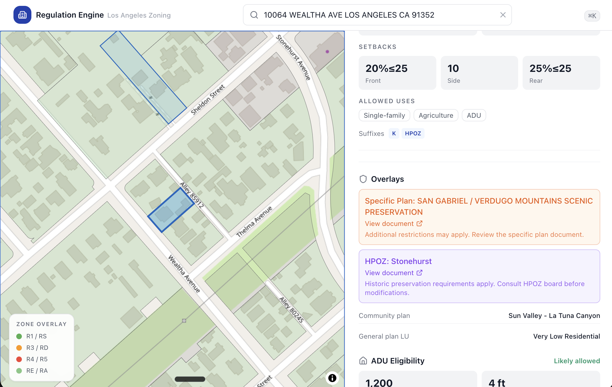
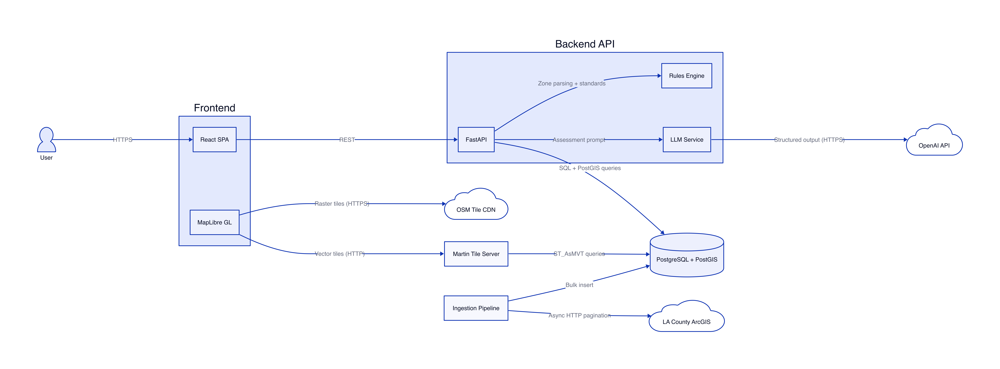
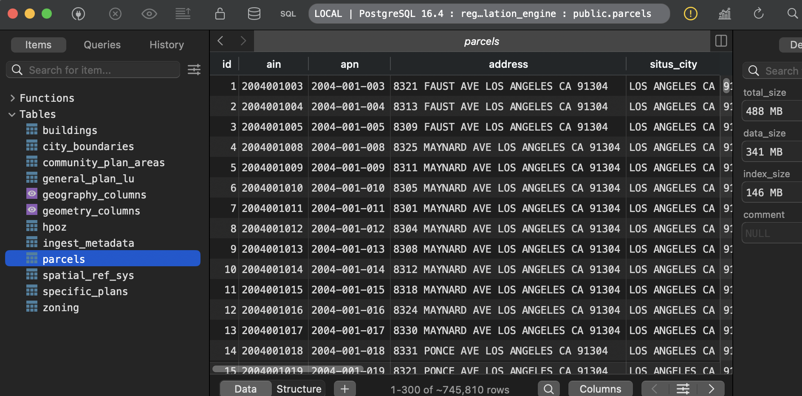

# LA Zoning Regulation Engine

Zoning lookup tool for Los Angeles residential parcels. Search by address or APN to get a full assessment: zone class, height/FAR/setback standards, ADU eligibility, overlay warnings, confidence score, and a plain-language summary.

**Live demo:** [frontend-production-349e.up.railway.app](https://frontend-production-349e.up.railway.app/)



## How It Works



1. User searches by address or APN
2. PostGIS spatial joins determine zoning, overlays, and jurisdiction
3. Rules engine computes standards, FAR, ADU, confidence
4. LLM summarizes the deterministic results — optional, with graceful fallback
5. Frontend renders the assessment alongside an interactive map

All GIS data is bulk-seeded into PostGIS. Lookups are sub-100ms spatial joins, not live API calls.

## Data Ingestion



The ingestion pipeline pulls 1M+ records from 8 LA County/City ArcGIS REST endpoints — parcels, zoning polygons, overlays, building footprints, community plans, and city boundaries. Each layer is paginated, geometries are transformed to EPSG:4326, and records are bulk-inserted into PostGIS with spatial indexes. The same pipeline runs against both local Docker Compose and deployed Railway databases.

See [Data Sources](docs/DATA_SOURCES.md) for endpoint details and field mappings.

## Stack

| Layer | Technology |
|-------|-----------|
| Backend | Python 3.12, FastAPI, async SQLAlchemy, GeoAlchemy2 |
| Frontend | TypeScript 5.9, React 19, Tailwind CSS |
| Map | MapLibre GL JS, Martin tile server, OSM raster base |
| Database | PostgreSQL 17 + PostGIS |
| LLM | OpenAI, structured output, citation whitelist |
| Deployment | Railway |

## Getting Started

**Prerequisites:** Docker, Node.js 22+, pnpm, Python 3.12+, uv

```bash
cp .env.example .env               # add OPENAI_API_KEY if you have one

docker compose up                  # start PostGIS, Martin, backend server

cd ingestion && uv sync            # seed the database
uv run python create_tables.py
uv run python ingest.py            # Takes ~1 hour
cd ..

cd frontend && pnpm install        # start the frontend
pnpm dev
```

Frontend: `localhost:5173` · Backend: `localhost:8000` · Martin: `localhost:3001`

## Coverage

~15 residential zone classes (R1, R2, R3, R4, R5, RD, RS, RA, RE) covering ~95% of LA City residential parcels. Unsupported zones return a low-confidence assessment with a "review manually" note.

## Docs

| Document | Contents |
|----------|----------|
| [Product Overview](docs/product-overview.md) | Architecture, API, data layer, key patterns |
| [Architecture Decisions](docs/decisions.md) | ADRs: PostGIS bulk seed, deterministic-first, curated rules |
| [Data Sources](docs/DATA_SOURCES.md) | ArcGIS endpoints, field mappings, ingestion strategy |
| [Deployment](docs/deployment.md) | Railway auto-deploy configuration |
